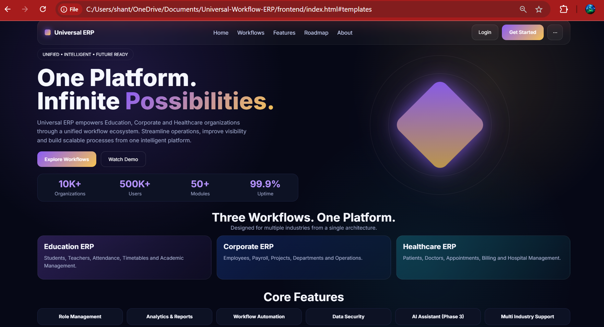
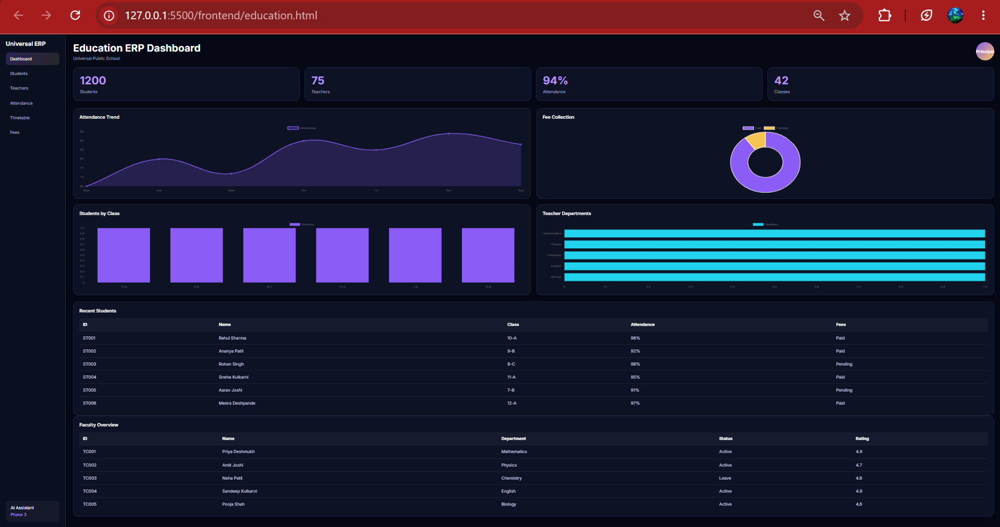
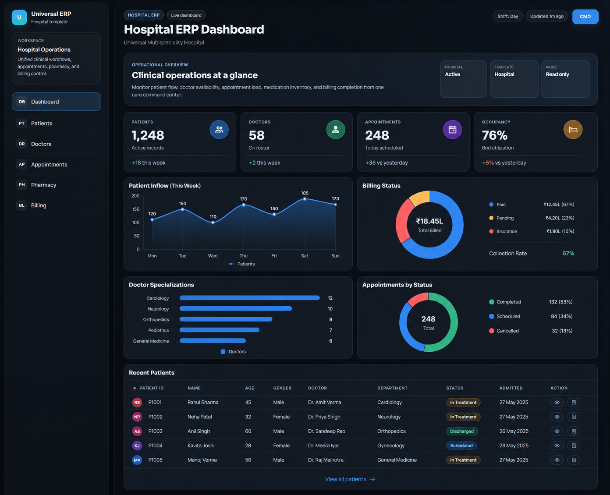
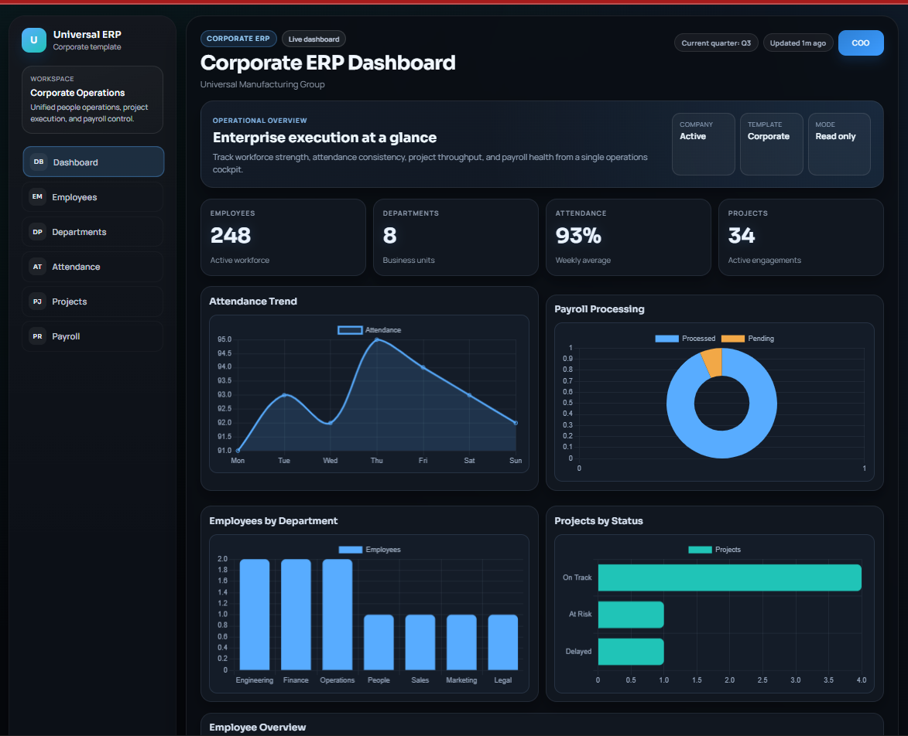

# Universal Workflow ERP

## Preview

### Landing Page

---

### Education ERP Dashboard

---

### Hospital ERP Dashboard

> A hospital management dashboard designed for patient records, doctor management, appointments, pharmacy operations, and billing.  
> This template showcases how the Universal Workflow ERP architecture can be extended to healthcare workflows without changing the underlying platform design.

---

### Corporate ERP Dashboard

> A modern corporate workflow dashboard focused on employee management, departments, attendance, projects, and payroll.  
> Built using the same modular architecture as the Education template, demonstrating how the platform adapts to different industries while maintaining a consistent user experience.

---

> A modular ERP platform capable of adapting to multiple industries through configurable workflow templates, unified scheduling, interactive dashboards, and a reusable workflow engine.

---

## Vision

Most ERP systems are designed for a specific industry and require significant customization before they become useful.

Universal Workflow ERP aims to provide a common workflow engine that can adapt to multiple industries through predefined templates while maintaining a unified scheduling and resource management core.

Instead of building separate systems for education institutes, corporate offices, hospitals, manufacturing units, or logistics operations, this project focuses on creating a reusable workflow framework capable of handling scheduling, resource allocation, reporting, and operational planning.

---

## Current Prototype

The current prototype demonstrates the foundation of the Universal Workflow ERP platform.

Implemented modules include:

- Premium Landing Page
- Education ERP Dashboard
- Interactive Chart.js Analytics
- JSON-driven sample datasets
- Responsive dashboard layout

Upcoming prototype modules:

- Corporate ERP
- Hospital ERP

---

## Problem Statement

Organizations often face similar operational challenges:

- Resource allocation
- Schedule creation
- Capacity planning
- Workload balancing
- Utilization tracking
- Operational reporting

Although industries differ in terminology, the underlying workflow remains similar.

Examples:

| Industry | Resources | Tasks |
|-----------|-----------|--------|
| Education | Teachers | Classes |
| Corporate | Employees | Projects |
| Hospital | Doctors | Appointments |
| Manufacturing | Machines | Jobs |
| Logistics | Vehicles | Deliveries |

Universal Workflow ERP aims to solve these challenges using a common scheduling engine.

---

## Core Philosophy

The platform follows four key principles:

### 1. Template Driven

Users begin with predefined operational templates instead of building systems from scratch.

### 2. Unified Scheduling Engine

A single scheduling engine powers all workflow types regardless of industry.

### 3. Excel Friendly

Excel remains a first-class citizen for data management, reporting, imports, and exports.

### 4. Minimal AI Dependency

The system prioritizes deterministic workflows and business logic over heavy AI usage.

AI is intentionally positioned as an assistant rather than a decision maker.

The platform prioritizes deterministic workflows and structured business logic. AI will initially support natural-language data retrieval while all business operations remain governed by workflow rules and user permissions.

---

## Supported Templates (Planned)

### Education Institute

- Faculty Management
- Classroom Scheduling
- Attendance Tracking
- Batch Management

### Coaching Center

- Student Batches
- Faculty Allocation
- Timetable Planning

### Corporate Office

- Employee Scheduling
- Project Allocation
- Meeting Room Management

### Hospital

- Doctor Scheduling
- Appointment Planning
- Ward Allocation

### Manufacturing Unit

- Machine Scheduling
- Production Planning
- Resource Allocation

### Logistics & Delivery

- Vehicle Assignment
- Delivery Planning
- Route Scheduling

### Event Management

- Staff Assignment
- Venue Scheduling
- Activity Planning

---

## Key Features

### Resource Management

Manage people, rooms, machines, vehicles, and other operational assets.

### Scheduling Engine

Generate schedules while respecting predefined constraints.

### Capacity Planning

Track utilization and identify bottlenecks.

### Excel Integration

Import and export operational data using structured spreadsheets.

### Reporting Dashboard

Visualize utilization, workload distribution, and operational performance.

### Workflow Simulation

Evaluate operational changes before implementation.

---

## Technology Stack

### Frontend

- HTML5
- CSS3
- JavaScript (ES6)

### Visualization

- Chart.js

### Data

- JSON
- Excel (Planned)

### Backend (Future)

- FastAPI

---

## Development Updates

### Completed

- [x] Product Vision
- [x] Repository Setup
- [x] Landing Page Prototype
- [x] Education ERP Dashboard
- [x] JSON Data Model
- [x] Chart.js Integration
- [x] Responsive Frontend

### In Progress

- [ ] Dashboard Refinement
- [ ] Corporate ERP Prototype

### Upcoming

- [ ] Hospital ERP
- [ ] Authentication
- [ ] Excel Integration
- [ ] Workflow Engine
- [ ] AI Assistant

---

## Road to Version 1.0

### Version 0.1

Project Foundation

### Version 0.2

Template Framework

### Version 0.3

Excel Integration Layer

### Version 0.4

Scheduling Engine

### Version 0.5

Validation & Constraints

### Version 0.6

Dashboard & Reporting

### Version 0.7

Workflow Simulation

### Version 1.0

Universal Workflow ERP Platform

---

## Status

🚧 Active Prototype Development

This project is currently focused on template modeling, UI/UX and workflow engine planning.

---

## Project Gallery

Current Version

- Landing Page
- Education Dashboard

Future Releases

- Corporate ERP
- Hospital ERP
- Authentication
- AI Assistant
  
---